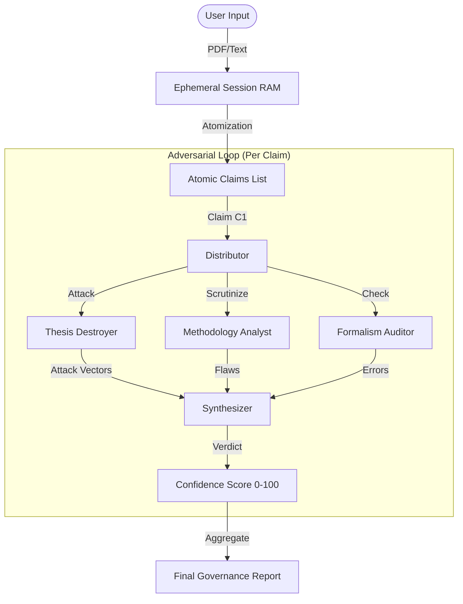

# ARGUS-Thesis System Architecture (Technical Whitepaper V2.0)

## Executive Summary
ARGUS-Thesis is a **Multi-Agent Governance Engine** designed to validate the logical coherence, methodological integrity, and novelty of academic research *before* peer review. Unlike standard "GenAI Wrappers" that rely on a single model to "critique" text, ARGUS-Thesis implements a **Consensus Protocol** involving six diverse, adversarial AI agents. This architecture eliminates "hallucinated praise" and enforcing a rigorous, compiler-like validation loop.

---

## 1. System Design Philosophy

### 1.1 The "Adversarial Compiler" Paradigm
Traditional LLM interactions are chat-based and prone to sycophancy. ARGUS treats research manuscripts as "source code" and the validation process as "compilation".
*   **Parsing**: The manuscript is parsed into an Abstract Syntax Tree (AST) of atomic claims.
*   **Unit Testing**: Each claim is subjected to "attacks" by adversarial agents.
*   **Compilation Error**: If a claim fails the attack, the "build" fails (Validation score drops).

### 1.2 "Privacy by Physics" (Ephemeral Architecture)
To serve institutional clients (Universities, R&D Labs), ARGUS enforces **Data Sovereignty**.
*   **RAM-Only Processing**: Ingested PDFs and extracted claims exist *only* in the ephemeral memory (RAM) of the active session.
*   **No Persistence**: The content of the manuscript is **NEVER** written to a long-term database (SQL or Vector).
*   **Deletion Certificate**: Upon session termination, a cryptographic proof of memory clearing is generated.

---

## 2. The Multi-Agent Swarm (Core Logic)

The heart of ARGUS is the **Governance/Validation Engine** (`argus/governance.ts`), which orchestrates a synchronized "Six-Adversary Protocol".

### 2.1 Agent Roster
| Agent ID | Archetype | System Prompt Objective | Model |
| :--- | :--- | :--- | :--- |
| **Thesis Constructor** | `STRUCTURALIST` | Deconstruct text into atomic Claims. Ignore rhetoric. | Gemini 1.5 Pro |
| **Thesis Destroyer** | `ADVERSARY` | Attack premises. Find logical fallacies. Ignore tone. | GPT-4o / Gemini Ultra |
| **Methodology Analyst** | `STATISTICIAN` | Scan for p-hacking, sample bias, and metric errors. | Gemini 1.5 Pro |
| **Literature Reviewer** | `HISTORIAN` | Check novelty against internal/external embeddings. | Perplexity (Online) |
| **Formalism Auditor** | `MATHEMATICIAN` | Verify equation balance and definitional recursion. | Gemini 1.5 Pro |
| **Reviewer Simulator** | `GATEKEEPER` | Synthesize attacks into a final Accept/Reject verdict. | Gemini 1.5 Pro |

### 2.2 The Consensus Graph (Mermaid)

---

## 3. Technical Stack & Infrastructure

### 3.1 Frontend & Orchestration
*   **Framework**: Next.js 16+ (App Router).
*   **State Management**: React Context (Session State).
*   **Styling**: Tailwind CSS + Shadcn/UI (The "Academic Light" Design System).
*   **PDF Handling**: `pdf-parse` (Server-side extraction), `jsPDF` (Report generation).

### 3.2 Backend Services (Serverless)
*   **API Runtime**: Vercel Edge Functions (for low latency) / Node.js Serverless.
*   **Model Gateway**: A robust **Tiered Fallback Router** (`lib/llm_router.ts`) managing quotas across Gemini, OpenAI, and Perplexity.
    *   *Tier 1 (High Reasoning)*: Gemini 1.5 Pro.
    *   *Tier 2 await (Speed)*: Gemini 1.5 Flash.
    *   *Tier 3 (Web)*: Perplexity Sonar.

### 3.3 Database & Storage (Supabase)
ARGUS follows a "Metadata Only" storage policy.
*   **`profiles`**: User identity, Organization linkage, Credit balance.
*   **`organizations`**: Enterprise entities (Universities) managing seats and credits.
*   **`usage_logs`**: An immutable ledger of *transactions* (e.g., "User X validated 5 claims"), but **NOT** the claims themselves.
*   **`sessions`**: Temporary session state (optional persistence for "Game Save" functionality, encrypted).

### 3.4 Security & Compliance
*   **Authentication**: Supabase Auth (Email/Password, Magic Link, SSO for Enterprise).
*   **RLS (Row Level Security)**: Strict PostgreSQL polices ensuring Users can only access their own metadata.
*   **Payment**: Razorpay integration for "Pay-as-you-go" credits.

---

## 4. Organization vs. Individual Architecture

### 4.1 The Hub-and-Spoke Model
*   **Individual**: A standard user (`profiles.org_id = null`). Purchases credits personally.
*   **Organization**: An entity (`organizations` table) that owns a pool of credits.
*   **Member**: A user linked to an organization (`profiles.org_id = UUID`). Inherits the Org's credit pool.

### 4.2 Onboarding Flows
1.  **Individual**: Self-service Sign Up. Immediate access.
2.  **Organization**: Admin-provisioned. The Admin invites uses via email.
    *   *Why?* prevents fraud and ensures proper domain verification for University licenses.

---

## 6. Enterprise Payment & Credit Flow (Two-Level)
ARGUS uses a hierarchical billing model to support University Departments.

1.  **Level 1: The Organization (Payer)**
    *   The **Department Head** (Org Admin) buys a "Credit Pack" (e.g., $1,499 for 100 Audits).
    *   These credits are stored in the `organizations` table (`credits_balance`).
    *   Payment Gateway: Razorpay -> `api/verify-payment` -> Updates `organizations`.

2.  **Level 2: The Researcher (Consumer)**
    *   Students/Researchers join the Organization via Invite Code.
    *   When they run an audit, the system checks `profiles.org_id`.
    *   If present, it calls `consume_credit(org_id)` RPC.
    *   Credits are deducted from the **Organization's Pool**, not the user's personal wallet.
    *   *Analogy*: Similar to a Corporate Uber account. The company pays, the employee rides.

---

## 5. Deployment & CI/CD
*   **Repo**: GitHub (Monorepo).
*   **Verifications**: `scripts/verify_system.ts` runs E2E safety checks on every commit.
*   **Environment**: Vercel Production.

---

**© 2024 ARGUS Governance.**
