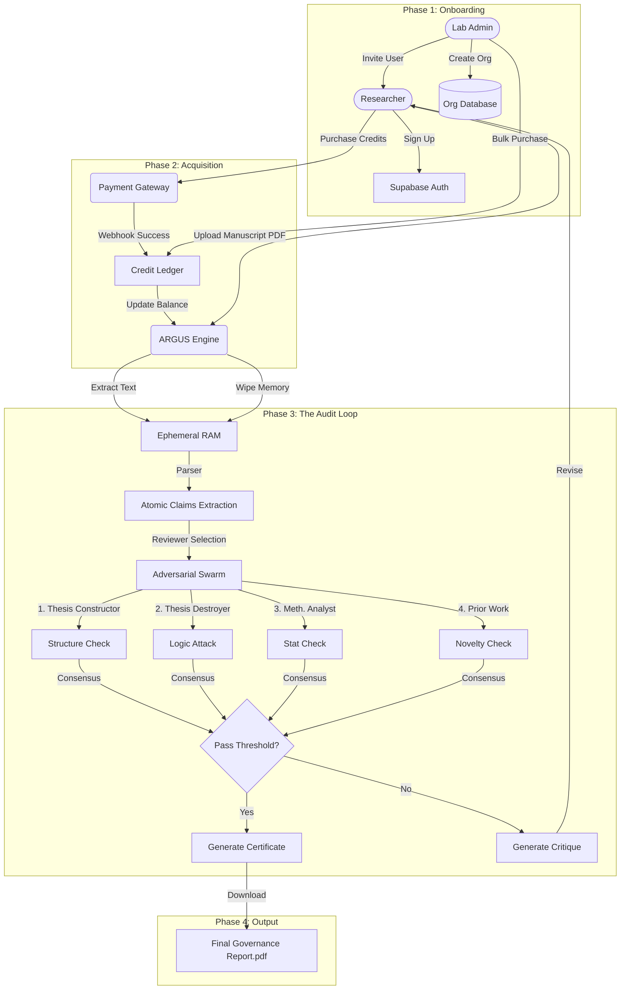

# ARGUS-Thesis System Architecture (Technical Whitepaper V3.0)

## Executive Summary
ARGUS-Thesis is a **Multi-Agent Governance Engine** designed to validate the logical coherence, methodological integrity, and novelty of academic research *before* peer review. Unlike standard "GenAI Wrappers", ARGUS implements a **Consensus Protocol** involving six diverse, adversarial AI agents. This architecture eliminates "hallucinated praise" by enforcing a rigorous, compiler-like validation loop.

---

## 1. Business Process Flow
The following diagram illustrates the end-to-end journey of a user (Researcher) through the ARGUS system, from account creation to the final certified report.



---

## 2. Technical Architecture
ARGUS employs a **Serverless Event-Driven Architecture** built on the Modern Data Stack (MDS).

```mermaid
graph LR
    subgraph "Client Layer (Next.js 16)"
        UI[React UI / Shadcn]
        State[Context API (Session)]
        PDF_W[jsPDF Writer]
    end

    subgraph "Edge Layer (Vercel)"
        API[Next.js API Routes]
        Router[LLM Tiered Router]
        Auth_Edge[Middleware Auth]
    end

    subgraph "Core Intelligence (AI Swarm)"
        Router -->|Tier 1: High Reasoning| GemPro[Gemini 1.5 Pro]
        Router -->|Tier 2: Speed| GemFlash[Gemini 1.5 Flash]
        Router -->|Tier 3: Search| Perplexity[Perplexity Sonar]
    end

    subgraph "Data Persistence (Supabase)"
        DB[(PostgreSQL)]
        Logs[Audit Logs (Metadata Only)]
        Profiles[User Profiles]
        Orgs[Organization Tables]
    end

    %% Connections
    UI -->|HTTPS/JSON| API
    API -->|Auth Check| Auth_Edge
    API -->|Token Mgmt| Router
    API -->|Read/Write Meta| DB
    
    %% Constraints
    Note[NO MANUSCRIPT TEXT STORED IN DB]
    style Note fill:#ff9999,stroke:#333,stroke-width:2px
```

---

## 3. The "Adversarial Compiler" Paradigm
Traditional LLM interactions are chat-based and prone to sycophancy. ARGUS treats research manuscripts as "source code" and the validation process as "compilation".

### 3.1 The Life of a Claim
1.  **Parsing (Lexing)**: The manuscript is deconstructed into an Abstract Syntax Tree (AST) of atomic claims.
2.  **Unit Testing**: Each claim in the AST is subjected to "attacks" (unit tests) by adversarial agents.
3.  **Compilation Error**: If a claim fails the attack (logic flaw, p-hacking), the "build" fails.
4.  **Green Build**: Only when all critical claims pass does the system issue a "Certified" status.

### 3.2 Agent Roster
| Agent ID | Archetype | System Prompt Objective | Model |
| :--- | :--- | :--- | :--- |
| **Thesis Constructor** | `STRUCTURALIST` | Deconstruct text into atomic Claims. Ignore rhetoric. | Gemini 1.5 Pro |
| **Thesis Destroyer** | `ADVERSARY` | Attack premises. Find logical fallacies. Ignore tone. | GPT-4o / Gemini Ultra |
| **Methodology Analyst** | `STATISTICIAN` | Scan for p-hacking, sample bias, and metric errors. | Gemini 1.5 Pro |
| **Literature Reviewer** | `HISTORIAN` | Check novelty against internal/external embeddings. | Perplexity (Online) |
| **Formalism Auditor** | `MATHEMATICIAN` | Verify equation balance and definitional recursion. | Gemini 1.5 Pro |
| **Reviewer Simulator** | `GATEKEEPER` | Synthesize attacks into a final Accept/Reject verdict. | Gemini 1.5 Pro |

---

## 4. Security & Data Sovereignty ("Privacy by Physics")
To serve institutional clients (Universities, R&D Labs), ARGUS enforces a strict **Zero Retention Policy**.

### 4.1 Ephemeral Memory Architecture
*   **RAM-Only Processing**: Ingested PDFs and extracted text exist *only* in the ephemeral memory (RAM) of the active serverless function execution.
*   **No Database Persistence**: The content of the manuscript is **NEVER** written to a long-term database (SQL or Vector). We only store *metadata* (File Name, Word Count, Score) for audit logs.
*   **Deletion Certificate**: Upon session termination (or timeout), the RAM is released. The system logs a "Wipe Event" to the ledger.

### 4.2 Application Security
*   **Authentication**: Supabase Auth (Email/Password, Magic Link, SSO).
*   **RLS (Row Level Security)**: Strict PostgreSQL policies ensuring Users can only access their own metadata.
*   **Payment Security**: Razorpay integration handles all PCI-DSS requirements. We do not store card details.

---

## 5. Enterprise & Organization Model
ARGUS uses a hierarchical billing and permission model.

### 5.1 The Hub-and-Spoke
*   **Level 1: Organization**: The legal entity (Department/Lab) that owns the Credit Pool.
*   **Level 2: Member**: Researchers linked to an Org via `profiles.org_id`.
*   **Shared Billing**: When a Member runs an audit, credits are deducted from the Organization's pool, not the user's personal wallet.

---

## 6. Deployment & CI/CD
*   **Repo**: GitHub (Monorepo).
*   **Verifications**: `scripts/verify_system.ts` runs E2E safety checks on every commit.
*   **Environment**: Vercel Production (Edge Network).
*   **Framework**: Next.js 16+ (App Router).

---

**© 2024 ARGUS Governance.**
