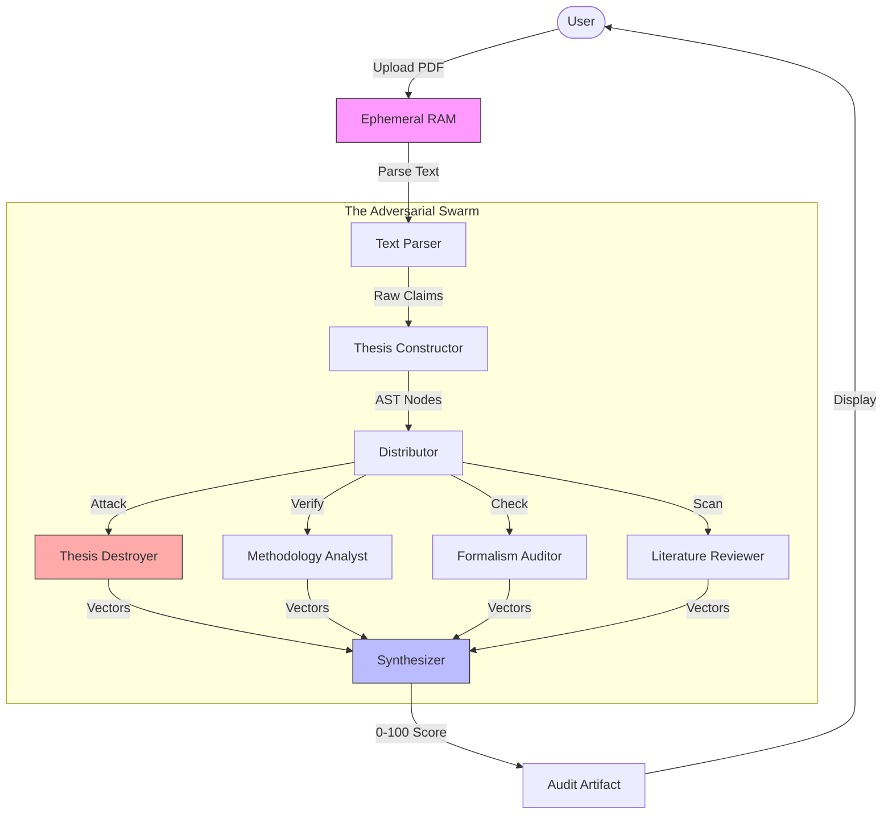

# ARGUS System Architecture (Technical Whitepaper)

## Core Philosophy: "The Adversarial Compiler"
Argus differs from standard "GenAI Wrappers" by implementing a **Multi-Agent Consensus Protocol**. Instead of asking one model to "critique" a paper (which leads to hallucinated praise), Argus spins up **6 conflicting agents** with opposing system prompts.

This is modeled after the **Adversarial Training** concept in ML, but applied to semantic logic.

---

## 1. The Swarm Controller (`useGovernance.ts`)
The governance engine is a client-side orchestrator that manages the state of the 6 agents.

### The Agent Roster
| Agent ID | Role | System Prompt Objective |
| :--- | :--- | :--- |
| **Thesis Constructor** | `STRUCTURALIST` | Extract the Abstract Syntax Tree (AST) of the argument. Ignore rhetoric. |
| **Thesis Destroyer** | `ADVERSARY` | Find the weakest link in the AST. Attack premises, not conclusions. |
| **Methodology Analyst** | `STATISTICIAN` | Scan for p-hacking, sample bias, and metric misalignment. |
| **Reviewer Simulator** | `GATEKEEPER` | Predict the likely outcome (Accept/Reject) based on top-tier journal patterns. |
| **Formalism Auditor** | `MATHEMATICIAN` | Check definitions and equation balance. |
| **Literature Reviewer** | `HISTORIAN` | Check novelty against internal knowledge base embeddings. |

### System Data Flow (The "Swarm Protocol")

### The "Loop"
1.  **Ingestion**: PDF is parsed into raw text.
2.  **Atomization**: The `Constructor` breaks text into Claims (Nodes).
3.  **Attack Phase**: The `Destroyer` and `Analyst` run in parallel against each Claim Node.
4.  **Consensus**: The `Simulator` aggregates the attack vectors into a final `0-100` score.

---

## 2. Ephemeral Data Pipeline (Privacy)
A critical selling point for institutional clients is **Data Sovereignty**.

*   **No Database Persistence**: The manuscript text is NEVER stored in Supabase or any vector DB.
*   **RAM-Only Processing**: Text exists only in the active browser session and the stateless API request payload.
*   **Deletion Certificate**: On session close, the client clears the React state tree, effectively "shredding" the document.

---

## 3. Tech Stack Deep Dive

### Backend (Next.js API Routes)
*   **Runtime**: Edge / Node.js
*   **Model Routing**: `api/gemini/route.ts` implements a "Tiered Fallback" router.
    *   *Primary*: `gemini-1.5-pro` (Reasoning Agents)
    *   *Secondary*: `gemini-1.5-flash` (Fast Agents)
    *   *Fallback*: `gemini-2.0-flash-exp` (Experimental/Free Tier overflow)

### Database (Supabase)
*   **`profiles`**: User metadata, billing tier, institution.
*   **`audit_logs`**: Immutable ledger of *actions* (e.g., "User X scanned 5000 chars"), but NOT the content.
*   **`transactions`**: Razorpay payment records linked to audit sessions.

### Security (RLS)
*   **Policy**: `auth.uid() = user_id`. Strict ownership.
*   **Admin Bypass**: Only the `verify-payment` webhook has Service Role access to unlock features.

---

## 4. Scalability Note
The current implementation is **Stateless**. Scaling is purely a function of API Quota (Gemini) and Database Connections (Supabase). There are no stateful servers or queues to manage.

---

**© 2024 Argus Governance** coverage of System V2.0.
