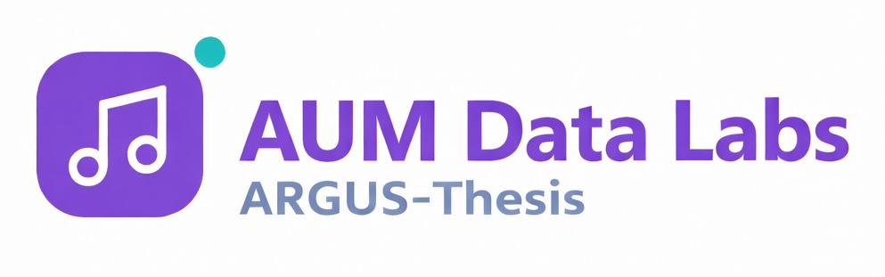

# ARGUS | Adversarial Research Governance System (V3.0)

> **Pre-flight validator for high-impact research papers.**  
> *Calibrated for researchers at top universities and R&D labs.*



## 🛡️ System Overview

**ARGUS** is a **deterministic adversarial compiler** for academic manuscripts. It treats a research paper as code, compiling it against strict logical axioms and novelty requirements before it reaches a human peer reviewer.

By simulating the scrutiny of 6 distinct adversarial agents (The Critic, The Statistician, The Reviewer, etc.), Argus helps researchers:
1.  **Reduce Desk Rejections** by identifying fatal logical flaws early.
2.  **Standardize Output** across large labs or departments.
3.  **Certify Rigor** with a timestamped "Audit Artifact".

---

## 🏗️ Dual-Purpose Architecture

This codebase serves two primary functions:

### 1. The ARGUS Platform (Next.js Application)
A production-ready web application providing a user-friendly interface for researchers to upload manuscripts, track audit progress, and manage organization-level credits.
- **Location**: `app/`, `components/`, `lib/`, `supabase/`

### 2. The Thesis Research Pipeline (Validation Framework)
An extensive suite of scripts and data used for "Brutal Hardening" and validating the epistemic defense capabilities of the multi-agent swarm. This pipeline was used for the MS-LJMU Thesis.
- **Location**: `scripts/`, `data/validation/`

---

## 🛠 Tech Stack

*   **Frontend**: Next.js 16 (React 19), Tailwind CSS v4, Lucide React.
*   **Backend**: Next.js API Routes, Supabase (PostgreSQL + RLS).
*   **AI Engine**: Google Gemini 1.5 Pro/Flash (Primary), OpenAI (Fallback).
*   **Payment & Auth**: Razorpay Integration, Supabase Auth (SSO/Magic Link).
*   **Validation**: Playwright (E2E), Custom TypeScript/Python Research Pipeline.

---

## 🚀 Getting Started

### Local Development (Platform)

1.  **Clone & Install**
    ```bash
    git clone https://github.com/aum-metrics/ARGUS.git
    cd ARGUS
    npm install
    ```

2.  **Environment Setup**
    ```bash
    cp env.example .env.local
    # Fill in GEMINI_API_KEY, SUPABASE_URL, etc.
    ```

3.  **Run Dev Server**
    ```bash
    npm run dev
    ```

### Research Pipeline (Scripts)

To run the validation pipeline or utility scripts:
```bash
# Example: Run system verification
npx tsx scripts/verify_system.ts

# Example: Process validation papers
npx tsx scripts/process_validation_papers.ts
```

---

## 🔐 Security & "Privacy by Physics"

*   **Zero-Retention Policy**: Manuscripts are processed in ephemeral RAM and never stored in the database.
*   **Audit Trails**: Metadata-only logging for billing and compliance.
*   **GDPR/CCPA**: Complete data self-destruct features for user profiles.

---

## 📄 Documentation

For deep technical details, refer to:
- [ARCHITECTURE.md](file:///Users/sambath/Documents/CODE/coding/MultiAIThesis/ARCHITECTURE.md) - High-level system design.
- [tech_specs.md](file:///Users/sambath/Documents/CODE/coding/MultiAIThesis/tech_specs.md) - Detailed component and agent specifications.
- [USER_GUIDE.md](file:///Users/sambath/Documents/CODE/coding/MultiAIThesis/USER_GUIDE.md) - Platform usage instructions.

---

**© 2026 ARGUS Governance. All Rights Reserved.**
